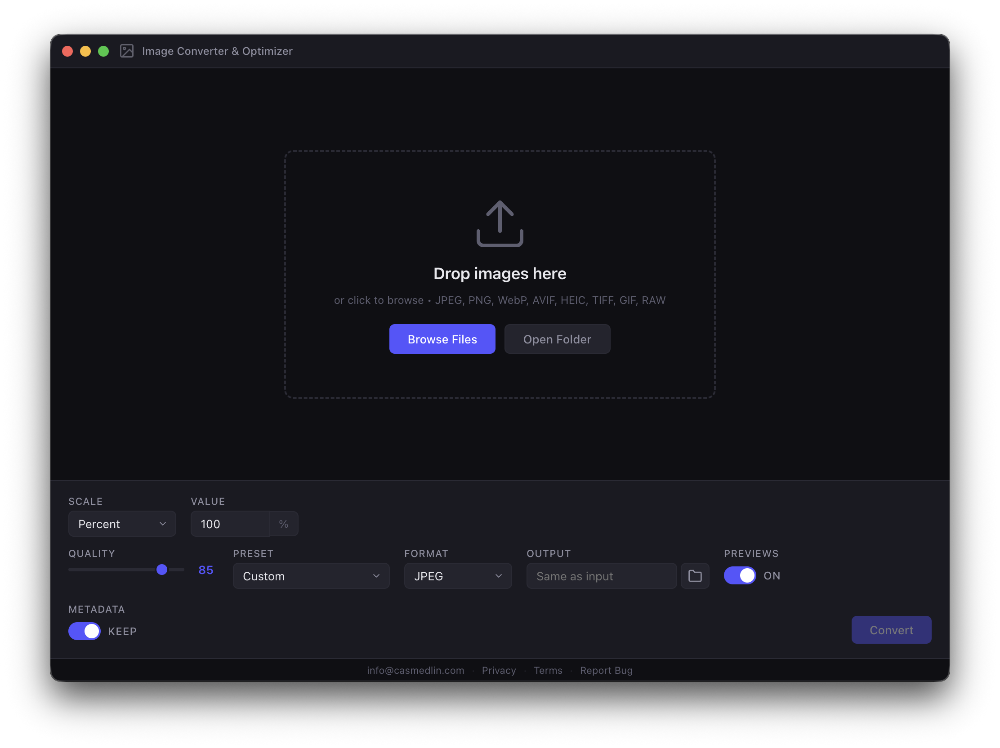

# Image Converter & Optimizer

[](LICENSE)
[](https://github.com/casmedlin/image-converter/releases)

A cross-platform desktop app for batch image conversion, resizing, and optimization. Built with Electron and [sharp](https://sharp.pixelplumbing.com/).

## Features

- **Batch convert** between JPEG, PNG, WebP, AVIF, HEIC, TIFF, and GIF
- **Resize** by percent, exact dimensions, or preset
- **Presets** for icons (iOS, Android, macOS, Windows), social media (Instagram, Facebook, Twitter/X, LinkedIn), web (WebP Hero, AVIF Mobile), devices (1080p, 4K), and print (4×6, 5×7, A4)
- **Quality control** with real-time slider
- **Metadata** keep or strip
- **RAW support** — imports CR2, CR3, NEF, ARW, DNG, and 20+ raw formats
- **Drag & drop** or folder import
- **Privacy-first** — 100% offline, no data leaves your device



## Downloads

| Platform | Architecture | Link |
|----------|-------------|------|
| macOS    | Intel       | [Image Converter & Optimizer-1.0.0-mac-x64.dmg](https://github.com/casmedlin/image-converter/releases/latest) |
| macOS    | Apple Silicon | [Image Converter & Optimizer-1.0.0-mac-arm64.dmg](https://github.com/casmedlin/image-converter/releases/latest) |
| Windows  | x64         | [Image Converter & Optimizer-1.0.0-win-x64.exe](https://github.com/casmedlin/image-converter/releases/latest) |
| Windows  | ARM64       | [Image Converter & Optimizer-1.0.0-win-arm64.exe](https://github.com/casmedlin/image-converter/releases/latest) |
| Linux    | x86_64      | [Image Converter & Optimizer-1.0.0-linux-x86_64.AppImage](https://github.com/casmedlin/image-converter/releases/latest) |
| Linux    | ARM64       | [Image Converter & Optimizer-1.0.0-linux-arm64.AppImage](https://github.com/casmedlin/image-converter/releases/latest) |

## Usage

1. **Add images** — drag & drop, click to browse, or open a folder
2. **Configure** — choose output format, quality, scale, and preset
3. **Convert** — click Convert and watch progress in real-time
4. **Review** — see size savings and dimensions before closing

All processing happens locally using the [sharp](https://sharp.pixelplumbing.com/) library. No uploads, no tracking, no internet required.

## Build from Source

```bash
git clone https://github.com/casmedlin/image-converter.git
cd image-converter
npm install
npm start

# Build distributables
npm run build:mac        # macOS Intel + Apple Silicon
npm run build:mac:arm    # macOS Apple Silicon only
npm run build:win        # Windows x64 + ARM64
npm run build:linux      # Linux AppImage + deb
```

## License

MIT © [Cas Medlin](https://github.com/casmedlin)
